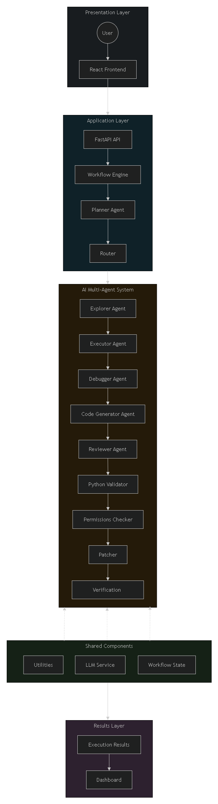

# AgentForge

**Autonomous AI Software Debugger using Multi-Agent Architecture**

AgentForge is an AI-powered software debugging system that autonomously analyzes Python runtime errors, generates intelligent fixes, reviews the generated code, validates it, applies patches safely, and verifies the repair through a structured multi-agent workflow.

---

## Features

- Multi-Agent AI Architecture
- Automatic Runtime Error Detection
- Intelligent Error Analysis
- AI-Powered Code Generation
- AI Code Review
- Automatic Python Syntax Validation
- Automatic Patch Application
- Backup File Creation Before Patching
- Patch Verification
- Execution Workflow Visualization
- Professional React Dashboard
- FastAPI Backend
- Relative File Path Detection
- Retry Mechanism for Failed Reviews

---

## Architecture

<p align="center">
  
</p>

---

## Multi-Agent Workflow

### Planner Agent

Creates an execution plan for debugging.

---

### Explorer Agent

Scans the project structure and collects contextual information.

---

### Executor Agent

Executes the target Python application inside a controlled environment.

---

### Debugger Agent

Analyzes runtime errors and identifies the root cause.

---

### Code Generator Agent

Generates corrected Python code using an LLM.

---

### Reviewer Agent

Reviews the generated fix and decides whether it should be accepted or retried.

---

### Validator

Performs Python syntax validation before patching.

---

### Patcher

Safely patches the source file while automatically creating a backup.

---

## Dashboard

The React dashboard displays:

- Initial Status
- Final Status
- Validation Result
- Execution Time
- Agents Used
- Execution Workflow
- Failure Analysis
- Patch Information
- Generated Fix
- Backup File Information

---

## Supported Python Errors

- NameError
- SyntaxError
- ModuleNotFoundError
- ImportError
- TypeError
- AttributeError
- FileNotFoundError

---

## Tech Stack

### Frontend

- React
- Vite
- CSS

### Backend

- FastAPI
- Uvicorn
- Python

### AI

- Google Gemini API
- Multi-Agent Workflow

### Utilities

- shutil
- subprocess
- traceback
- pathlib
- regex

---

## Project Structure

```
AgentForge/

│

├── backend/

│   ├── api.py
│   ├── workflow.py
│   ├── router.py
│   ├── planner.py
│   ├── explorer.py
│   ├── executor.py
│   ├── debugger.py
│   ├── codegen.py
│   ├── reviewer.py
│   ├── validator.py
│   ├── patcher.py
│   ├── error_parser.py
│   ├── permissions.py
│   ├── llm.py
│   ├── utils.py
│   ├── state.py
│   ├── sample_project/
│   └── .env

│

├── frontend/

│   ├── src/
│   ├── public/
│   └── package.json

│

└── README.md
```

---

## Installation

### Clone Repository

```bash
git clone https://github.com/yourusername/AgentForge.git

cd AgentForge
```

---

### Backend Setup

```bash
cd backend

python -m venv venv

venv\Scripts\activate

pip install -r requirements.txt
```

---

### Start Backend

```bash
uvicorn api:app --reload
```

Backend runs at:

```
http://127.0.0.1:8000
```

---

### Frontend Setup

```bash
cd frontend

npm install
```

---

### Start Frontend

```bash
npm run dev
```

Frontend runs at:

```
http://localhost:5173
```

---

## Example Workflow

User Input

```
My Flask app crashes
```

↓

Planner creates execution plan

↓

Explorer scans project

↓

Executor runs application

↓

Debugger analyzes runtime error

↓

Code Generator creates fix

↓

Reviewer validates AI-generated fix

↓

Validator checks Python syntax

↓

Patcher safely patches file

↓

Verification execution

↓

Dashboard displays final results

---

## Example Output

```
Initial Status

ERROR

↓

Final Status

SUCCESS

↓

Validation

Passed

↓

Patch Applied Successfully
```

---

## Safety Features

- Automatic Backup Creation
- Patch Permission Checks
- Syntax Validation Before Patching
- Retry Mechanism
- AI Review Before Applying Changes

---

## Future Improvements

- Support Multiple Programming Languages
- Docker Sandbox Execution
- Unit Test Generation
- Git Integration
- Multiple LLM Support
- Project-Level Debugging
- Automatic Dependency Installation
- WebSocket Live Execution Updates

---
